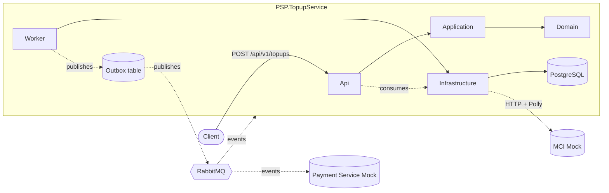

# Architecture

Clean Architecture + DDD for the PSP Topup Service. Dependencies point only
inward (toward the Domain). The rules are machine-checked by
`PSP.TopupService.ArchitectureTests` (ADR-0021).

## Layers

```
                     ┌─────────────────────────────────────────┐
                     │              Contracts                  │  (no internal deps)
                     │   Integration events / messages         │
                     └─────────────────────────────────────────┘
              ┌──────────────────────┐         ┌──────────────────────────────┐
   Api   ←──► │    Infrastructure   │  ←─→    │        Persistence           │
 Worker       │ MassTransit, MCI,   │         │  EF Core (PostgreSQL),       │
              │ Polly                │         │  repositories, outbox state  │
              └─────────┬────────────┘         └───────────────┬──────────────┘
                        │                                      │
                        ▼                                      ▼
                     ┌────────────────────────────────────────────┐
                     │              Application                   │
                     │   CQRS handlers, validators, behaviors,    │
                     │   abstractions (ITopupRepository, IOutbox) │
                     └──────────────────────┬─────────────────────┘
                                            │
                                            ▼
                     ┌────────────────────────────────────────────┐
                     │                Domain                      │
                     │   TopupTransaction aggregate, value         │
                     │   objects, domain events, exceptions        │
                     └──────────────────────┬─────────────────────┘
                                            │
                                            ▼
                     ┌────────────────────────────────────────────┐
                     │              SharedKernel                   │
                     │   Result, BaseEntity, ValueObject, IClock  │
                     └────────────────────────────────────────────┘
```

## Dependency matrix

| Layer | May depend on |
| --- | --- |
| SharedKernel | (nothing internal) |
| Domain | SharedKernel |
| Contracts | (nothing internal) |
| Application | Domain, SharedKernel |
| Persistence | Application, Domain, SharedKernel |
| Infrastructure | Application, Domain, Contracts, SharedKernel |
| Api | Application, Infrastructure, Persistence, Contracts |
| Worker | Application, Infrastructure, Persistence, Contracts |

## Component diagram



## Why this shape

- **Testability** — Domain and Application have zero knowledge of EF Core or
  MassTransit, so they are unit-testable in isolation.
- **Swappability** — The PostgreSQL provider, RabbitMQ broker and Hamrah-e-Aval
  HTTP client can be replaced without touching business logic.
- **Resilience** — Cross-cutting concerns (validation, logging, performance,
  transactions, exceptions) are centralised in MediatR pipeline behaviours.
- **Auditability** — Every state change is captured by `AuditSaveChangesInterceptor`
  inside the same transaction that persists the business change.

See [SequenceDiagram.md](SequenceDiagram.md) for the end-to-end topup flow,
[Database.md](Database.md) for the schema, and [DecisionLog.md](DecisionLog.md)
for the rationale behind each choice.
