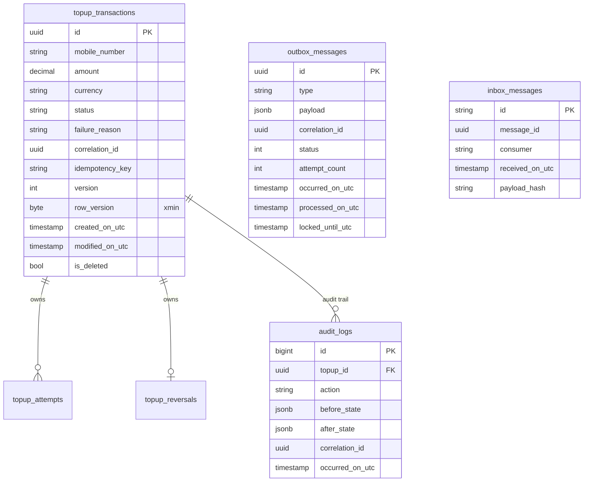

# Database

The Topup service persists all state in PostgreSQL via EF Core. Migrations live
in `src/PSP.TopupService.Persistence/Migrations` and are applied with
`dotnet ef database update` (or automatically at startup in development).

## Connection

```json
"ConnectionStrings": {
  "TopupDatabase": "Host=localhost;Port=5432;Database=topup;Username=postgres;Password=postgres"
}
```

## Schema



## Conventions

- **Naming**: snake_case for every table and column (EFCore.NamingConventions
  applied at the DbContext options level).
- **Value objects** are stored as EF Core **owned types** — flat columns on the
  parent row.
- **Child entities** (`TopupAttempt`, `ReverseRecord`) are owned by the
  aggregate root; the repository never touches them directly.
- **Optimistic concurrency**: `RowVersion` is mapped to PostgreSQL `xmin`
  via `IsRowVersion()`. Concurrent writers race-fail with sqlstate 40001.
- **Soft delete**: every auditable aggregate has `is_deleted` and a global query
  filter `is_deleted = false`.
- **Idempotency**: `topup_transactions.idempotency_key` has a unique partial
  index (`WHERE idempotency_key IS NOT NULL`).

## Indexes of note

- `outbox_messages (status, occurred_on_utc)` — partial index on
  `status = 0` (Pending) so the publisher worker's polling query is an
  index-only scan.
- `inbox_messages (message_id, consumer)` — unique index; the insert that
  violates it is the idempotency signal for a re-delivered message.
- `topup_transactions (correlation_id)` — for tracing queries.
- `topup_transactions (idempotency_key)` — unique partial index.
- `audit_logs (topup_id, occurred_on_utc)` — chronological audit lookup.

## Applying migrations

```bash
# Generate a migration
dotnet ef migrations add <Name> \
  --project src/PSP.TopupService.Persistence \
  --startup-project src/PSP.TopupService.Api

# Apply
dotnet ef database update \
  --project src/PSP.TopupService.Persistence \
  --startup-project src/PSP.TopupService.Api
```

## Testcontainers

Integration tests spin up a real PostgreSQL instance via
`Testcontainers.PostgreSql` — see [Deployment.md](Deployment.md).
