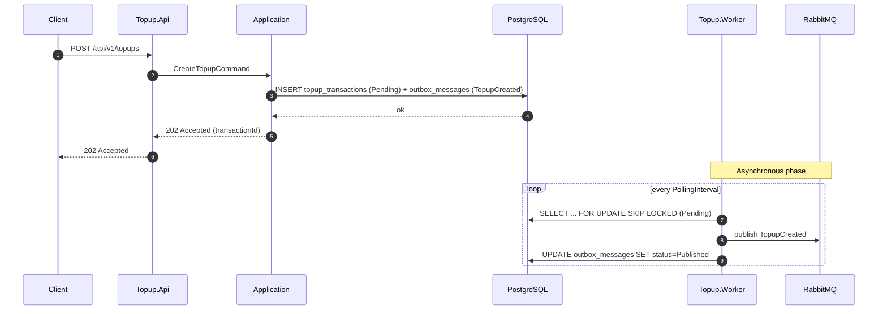
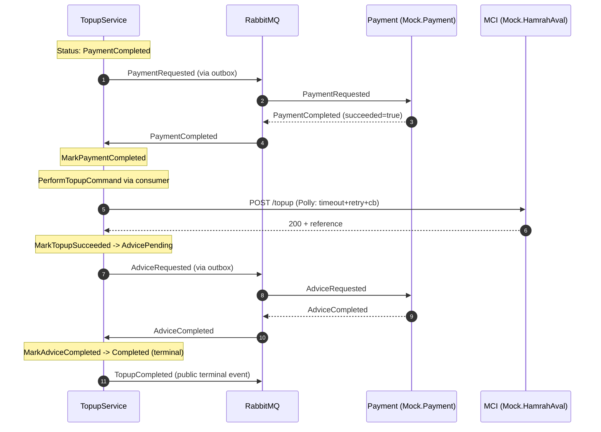
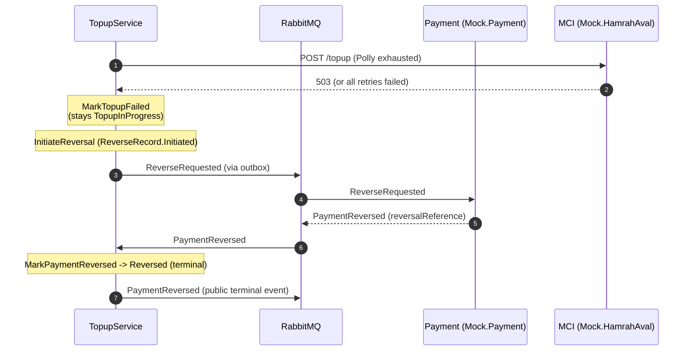
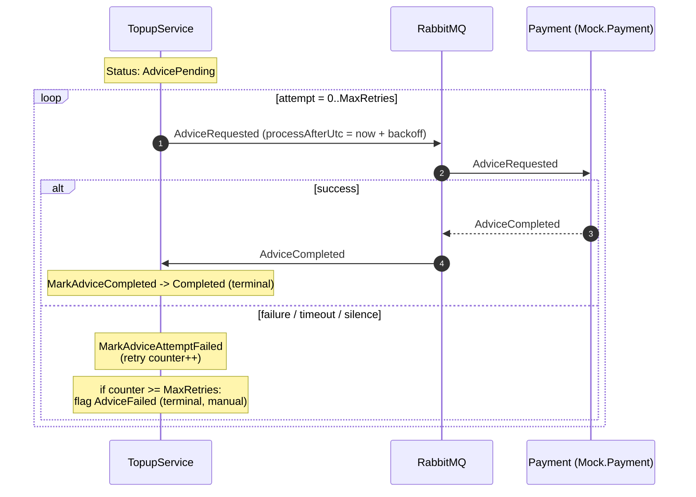
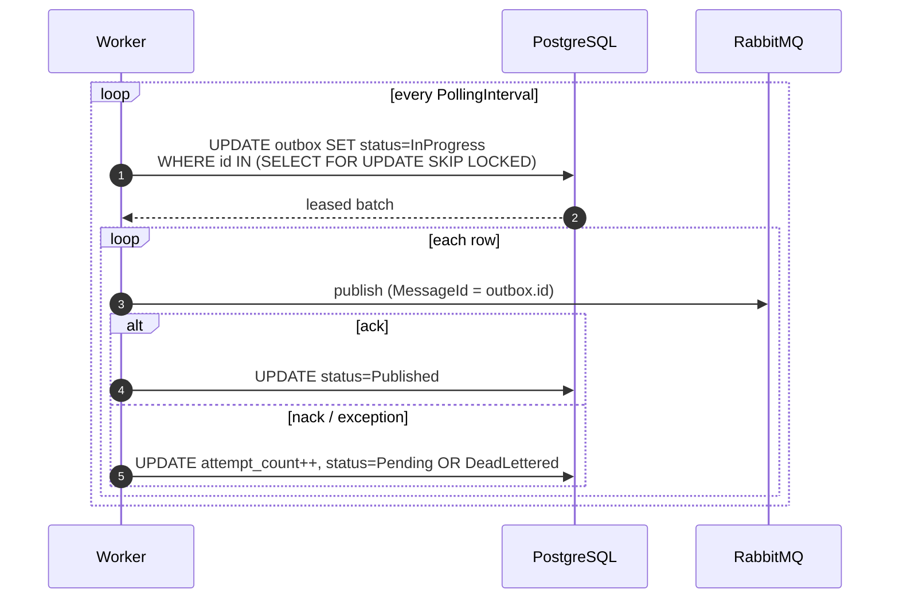
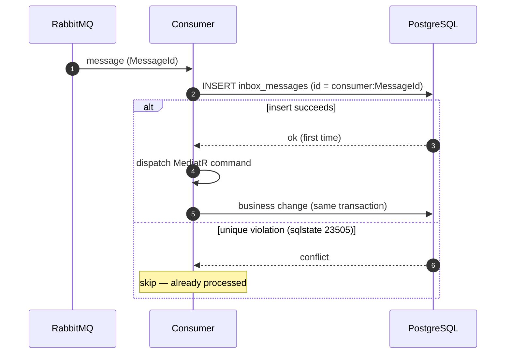

# Sequence Diagrams

The topup flow is **fully asynchronous** after the initial API call. Every
transition is driven by a RabbitMQ event and applied transactionally via the
outbox.

## 1. Create topup (synchronous API → outbox)

## 2. Payment + Topup + Advice happy path

## 3. Topup failure → reverse saga

## 4. Advice retry (Saga compensation)

## 5. Outbox publisher drain loop

## 6. Consumer idempotency (consume-local)

